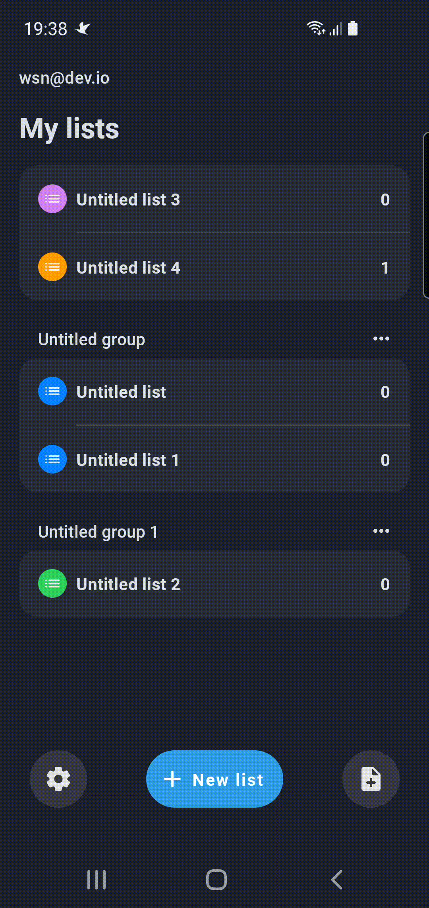
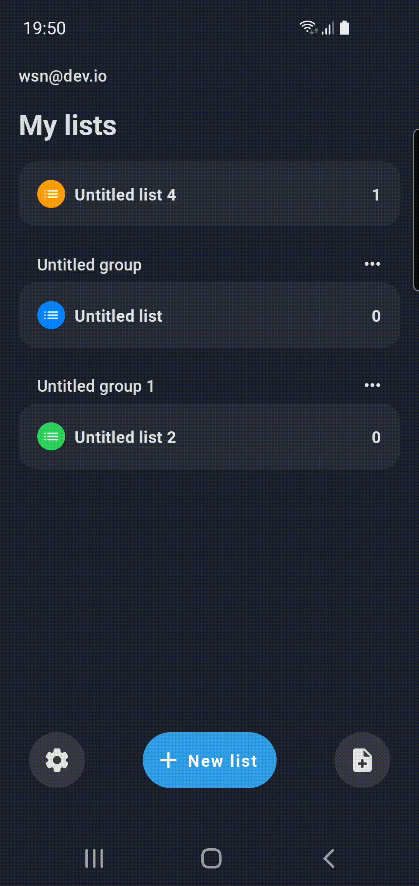

## Compose playground: To Do List App

Compose playground for learning purpose, especially trying and explore android tools by Google

* UI completely in [Jetpack Compose](https://developer.android.com/jetpack/compose)
* Uses [Kotlin Coroutines](https://kotlinlang.org/docs/reference/coroutines/coroutines-guide.html)
* Uses [Kotlin Flow](https://kotlinlang.org/docs/flow.html)
* Uses many of the [Architecture Components](https://developer.android.com/topic/libraries/architecture/), including: Room, DataStore, Navigation, ViewModel
* Uses [Hilt](https://dagger.dev/hilt/) for dependency injection
* Uses [Java 8+ API desugaring support](https://developer.android.com/studio/write/java8-support#library-desugaring), including: date and time

## Project specification

* Android Studio Arctic Fox | 2020.3.1
* Min SDK 24
* Target SDK 31
* AGP 7.0.2
* Java 11

## Setup

1. Clone this repository, `git clone https://github.com/wisnukurniawan/Compose-ToDo.git`
2. Open via [Android studio](https://developer.android.com/studio)
3. Sync the project, **File -> Sync Project with Gradle files**

## How to build

* Generate debug apk `./gradlew assembleDebug`
* Run unit test `./gradlew testDebug`
* Install on connected device `./gradlew installDebug`

## Dashboard screen

| Deletion | Lang selection | Theme selection |
| ---- | ---- | ---- |
|  |  |  |

## List detail screen

| Create list |
| ---- | 
| |

## Task detail screen

| Due date |
| ---- | 
|  |
