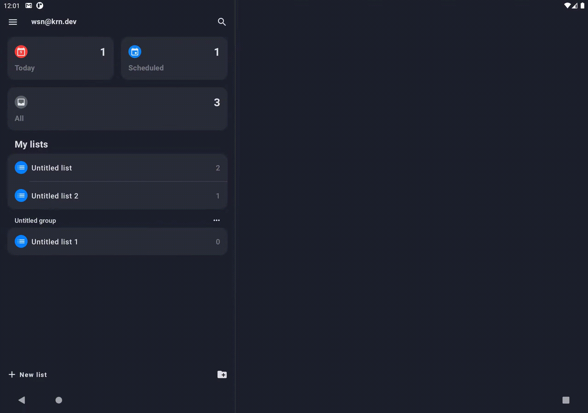
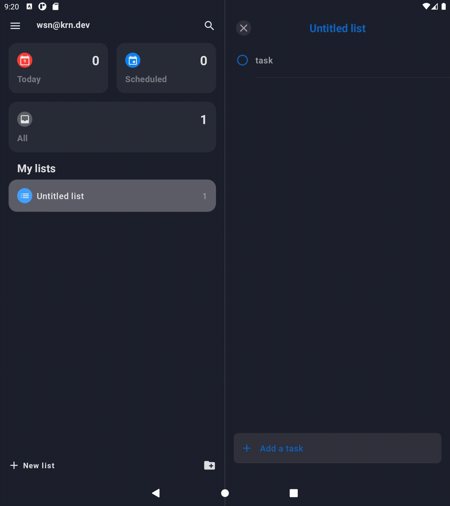
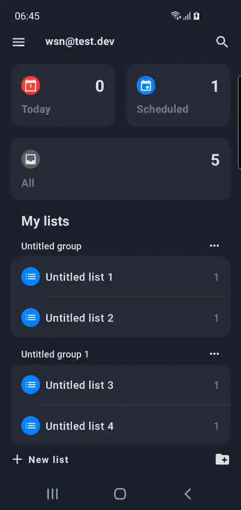

## Compose playground: To Do List App

Compose playground for learning purpose, especially trying and explore android tools by Google

* UI completely in [Jetpack Compose](https://developer.android.com/jetpack/compose)
* Uses [Kotlin Coroutines](https://kotlinlang.org/docs/reference/coroutines/coroutines-guide.html)
* Uses [Kotlin Flow](https://kotlinlang.org/docs/flow.html)
* Uses many of the [Architecture Components](https://developer.android.com/topic/libraries/architecture/), including: Room, DataStore, Navigation, ViewModel
* Uses [Hilt](https://dagger.dev/hilt/) for dependency injection
* Uses [Java 8+ API desugaring support](https://developer.android.com/studio/write/java8-support#library-desugaring) for date and time usage

| Large screen | Foldable |
| ---- | ---- |
|  |  |
| Multi language | Set alarm |
|  |  |

## Prerequisites

* Android Studio Bumblebee | 2021.1.1
* Min SDK 21
* Target SDK 31
* AGP 7.1.1
* Java 11
* Kotlin 1.6.10

## Setup

1. Clone this repository, `git clone https://github.com/wisnukurniawan/Compose-ToDo.git`
2. Open via [Android studio](https://developer.android.com/studio)
3. Sync the project, **File -> Sync Project with Gradle files**

## How to build

* Generate debug apk `./gradlew assembleDebug`
* Run unit test `./gradlew testDebug`
* Install on connected device `./gradlew installDebug`

## Others

* [Mercury architecture](https://github.com/wisnukurniawan/Compose-ToDo/blob/main/doc/architecture.md)
* [Project structure](https://github.com/wisnukurniawan/Compose-ToDo/blob/main/doc/project-structure.md)
* [Modularization](https://github.com/wisnukurniawan/Compose-ToDo/blob/main/doc/module.md)
